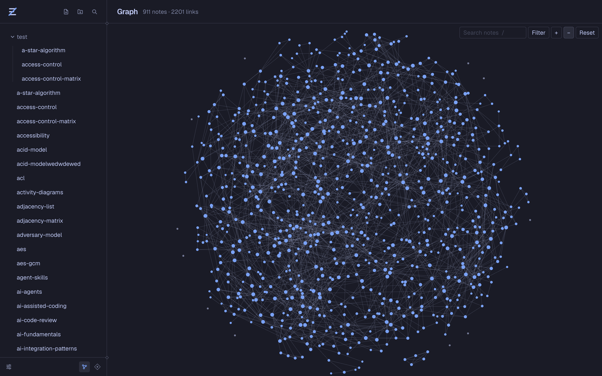
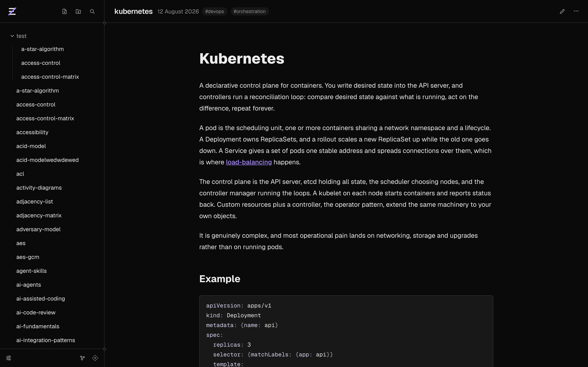
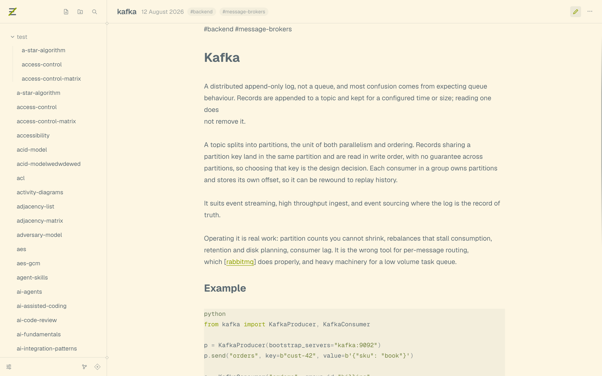
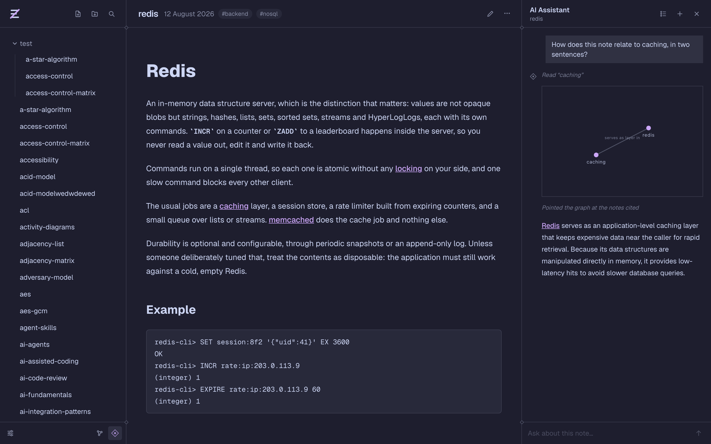
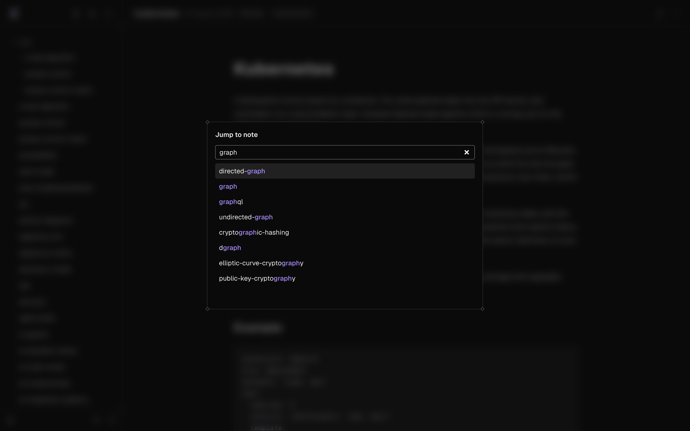
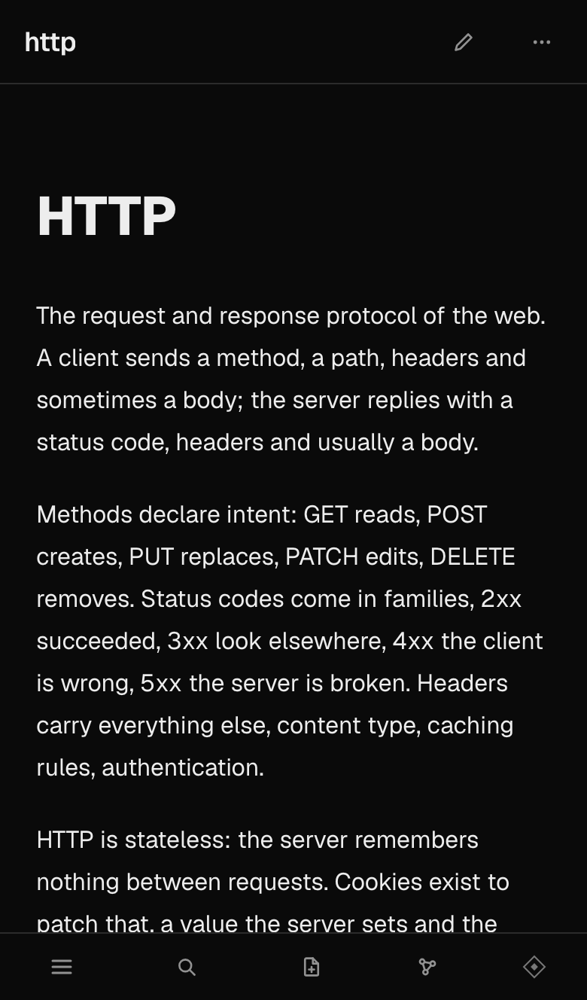
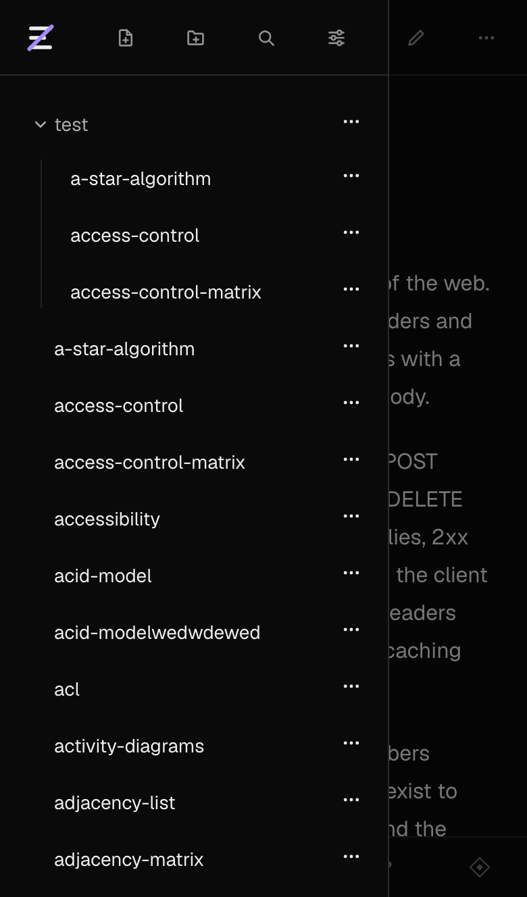
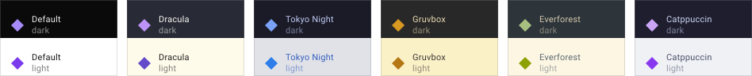

<picture>
  <source media="(prefers-color-scheme: dark)" srcset=".github/assets/wordmark-dark.svg">
  
</picture>

A markdown vault you open in a browser: linked notes, a map of how they connect,
and an assistant that can read them.

## The idea

Write in markdown. Link notes with `[[double brackets]]` and group them with `#tags`.
Everything saves as you type and is there from any browser you sign in on.

The picture above is the whole vault. Every dot is a note, every line a link between two of
them.

## Reading

Notes render with headings, code, tables, maths and diagrams. Links to other notes are
clickable, and links to notes you have not written yet are marked instead of broken.

At the bottom of each note: the notes around it in the graph, and **Linked from**, every place
in the vault that mentions this one, quoted in context.

## Writing

The editor keeps your markdown as you wrote it and formats it as you go. Type `[[` and it
suggests notes to link to. There is a Vim mode if you want one.

Saving happens on its own. If the same note is open in another tab, you get told rather than
losing what you typed.

## Asking

An assistant sits next to the note you are reading. It answers from your own notes, shows
which ones it opened, and can write notes back if you let it. Each conversation stays with its
note.

## Finding

`⌘K` jumps to any note by name. `⌘F` searches inside the one you are reading. The sidebar
searches titles or full text and filters by tag. Search runs in the browser, so results come
up as you type.

## Mobile mode

  
  

The web app also support mobile formats.

## Themes

Six themes, each with a dark and a light version.

## Shortcuts

| Keys  | Does                   |
| ----- | ---------------------- |
| `⌘K`  | Jump to a note         |
| `⌘F`  | Find in this note      |
| `/`   | Search the graph       |
| `Esc` | Close whatever is open |

## Built with

Next.js and React, CodeMirror for the editor, PixiJS for the graph, Supabase for the database
and the login, Gemini for the assistant. It runs on Vercel, and every push is checked and
shipped by GitHub Actions.

## License

[GPL-3.0](LICENSE).
